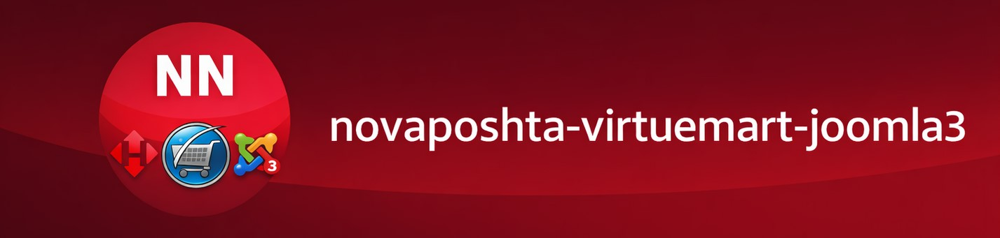

# Joomla Nova Poshta Plugin

A Joomla system plugin for integrating **Nova Poshta** delivery into VirtueMart 3.6.2+ (Joomla CMS).

---

### 📦 Features
- City autocomplete (API `getCities`)
- Warehouse selection (API `getWarehouses`)
- CSRF token validation
- Rate limiting to prevent excessive requests
- Error logging into Joomla system log

### 🔒 Security
- CSRF token check using Joomla session methods
- Whitelist of allowed API methods
- Input sanitization before sending requests
- Rate limiting to prevent abuse
- Sensitive data (API key) is stored only in plugin parameters and **never exposed in frontend code**

### ⚙️ Plugin Parameters
- **API key**: Nova Poshta API key. Stored securely in Joomla plugin configuration, never exposed in frontend.
- **Nova Method ID**: VirtueMart shipment method ID that corresponds to Nova Poshta. Used to show autocomplete block only when this method is selected.

### 🔑 How to Get API Key
1. Log in to your **Nova Poshta personal account**.
2. Go to **Settings → API 2.0**.
3. Generate a new API key or copy an existing one.
4. Paste this key into the plugin configuration in Joomla.

### ⚙️ Installation
1. Download the ZIP archive from GitHub Releases.
2. In Joomla admin panel, go to **Extensions → Install**.
3. Install the plugin as a standard extension.
4. Enable it in **System Plugins**.
5. Configure plugin parameters:
   - Enter your **Nova Poshta API key**.
   - Enter the **VirtueMart shipment method ID**.

### 🛠 Usage
- In VirtueMart checkout, when the Nova Poshta shipment method is selected, an autocomplete block appears.
- The customer enters a city name → receives a list of matching cities.
- After selecting a city, the list of warehouses is loaded.
- The chosen warehouse is automatically stored in hidden form fields for the order.

### 📋 Compatibility
- Joomla 3.9+
- VirtueMart 3.6.2 (build 10159)
- PHP 7.2+

### 📖 Documentation
This plugin uses the official **Nova Poshta API v2.0** as described in the [Nova Poshta documentation](https://developers.novaposhta.ua/en).

### 📝 License
GPLv3

